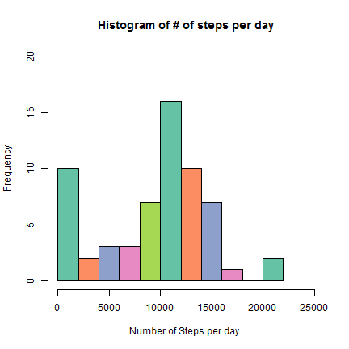
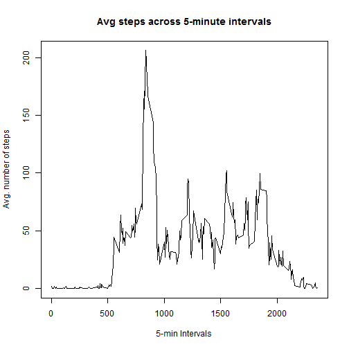
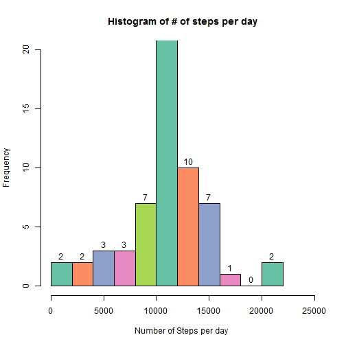
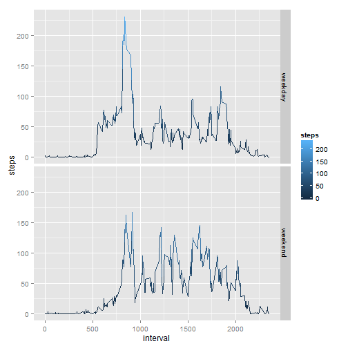

## I Loading and preprocessing the data

### 1.1 Load the data

| Ensure your session is pointing to the directory with the csv file.
| Use read.csv command to load the data.

```r
A <- read.csv("activity.csv")
```

### 1.2 Preprocess the data
| Check structure of the loaded dataset with str. Review elements of the dataset using head.
| Convert the loaded data set into a data frame. Load package for coloring the graphs.


```r
str (A)
```

```
## 'data.frame':	17568 obs. of  3 variables:
##  $ steps   : int  NA NA NA NA NA NA NA NA NA NA ...
##  $ date    : Factor w/ 61 levels "2012-10-01","2012-10-02",..: 1 1 1 1 1 1 1 1 1 1 ...
##  $ interval: int  0 5 10 15 20 25 30 35 40 45 ...
```

```r
head(A)
```

```
##   steps       date interval
## 1    NA 2012-10-01        0
## 2    NA 2012-10-01        5
## 3    NA 2012-10-01       10
## 4    NA 2012-10-01       15
## 5    NA 2012-10-01       20
## 6    NA 2012-10-01       25
```

```r
A <- data.frame(A)
options(warn = -1)
require(RColorBrewer)
```

```
## Loading required package: RColorBrewer
```

```r
library(ggplot2)
```
## II What is the mean total number of steps taken per day?

### 2.1 Calculate the total number of steps taken per day 
| Use tapply to calculate the total number of steps per day. Omit missing values.

```r
AMOD <- tapply(A$steps, A$date, sum, na.rm = TRUE)
head (AMOD)
```

```
## 2012-10-01 2012-10-02 2012-10-03 2012-10-04 2012-10-05 2012-10-06 
##          0        126      11352      12116      13294      15420
```
### 2.2 Make a histogram of the total number of steps taken each day 
| Call hist function to make a histogram of data from previous step

```r
hist( AMOD, breaks = 10, lables = TRUE, ylim = c(0, 20), xlim = c(0, 25000), main="Histogram of # of steps per day", xlab="Number of Steps per day ", col = brewer.pal(5, "Set2"))
```

 


###2.3 Calculate and report the mean and median of the total number of steps taken per day 


```r
mean(AMOD)
```

```
## [1] 9354.23
```

```r
median(AMOD)
```

```
## [1] 10395
```
| Mean of the total number of steps taken per day is 9354.23
| Median of the total number of steps taken per day is 10395

## III What is the average daily activity pattern?
### 3.1 Make a time series plot of the 5-minute interval and the average number of steps taken


```r
BMOD <- tapply(A$steps, A$interval, mean, na.rm = TRUE)
BMODName <- as.numeric(names(BMOD))
plot(BMODName, BMOD, type = "l", , main = "Avg steps across 5-minute intervals", xlab = "5-min Intervals", ylab = "Avg. number of steps")
```

 

### 3.2 Which 5-minute interval, on average across all the days in the dataset, contains the maximum number of steps?
| On average the maximum number of steps is 206. 
| The five minute interval number that contains the maximum number of steps is 104 th of the 288 total intervals. The interval is:

```r
names(BMOD)[which(grepl(max(BMOD), BMOD))]
```

```
## [1] "835"
```
## IV Imputing missing values
### 4.1 Calculate and report the total number of missing values in the dataset 
| The total number of missing values is NA's   :2304  .

```r
summary(A)
```

```
##      steps                date          interval     
##  Min.   :  0.00   2012-10-01:  288   Min.   :   0.0  
##  1st Qu.:  0.00   2012-10-02:  288   1st Qu.: 588.8  
##  Median :  0.00   2012-10-03:  288   Median :1177.5  
##  Mean   : 37.38   2012-10-04:  288   Mean   :1177.5  
##  3rd Qu.: 12.00   2012-10-05:  288   3rd Qu.:1766.2  
##  Max.   :806.00   2012-10-06:  288   Max.   :2355.0  
##  NA's   :2304     (Other)   :15840
```
### 4.2 Devise a strategy for filling in all of the missing values in the dataset.
| Relplace missing value by mean of the number of steps in a given interval


```r
L <- BMOD[match(A$interval, names(BMOD))]
I.steps <- ifelse(is.na(A$steps), L, A$steps)
```
### 4.3 Create a new dataset that is equal to the original dataset but with the missing data filled in.
| Creating a new dataset by replacing the steps column by Imputed steps column in A
| Text 2


```r
NEWA <- A
NEWA$steps <- I.steps
names(NEWA)[1] <- "I.steps"
str(NEWA)
```

```
## 'data.frame':	17568 obs. of  3 variables:
##  $ I.steps : num  1.717 0.3396 0.1321 0.1509 0.0755 ...
##  $ date    : Factor w/ 61 levels "2012-10-01","2012-10-02",..: 1 1 1 1 1 1 1 1 1 1 ...
##  $ interval: int  0 5 10 15 20 25 30 35 40 45 ...
```
### 4.4 (a) Make a histogram of the total number of steps taken each day
| Use tapply to generate the column of data with total number of steps by day. Use hist to plot the histogram.


```r
IAMOD <- tapply(NEWA$I.steps, NEWA$date, sum)
hist( IAMOD, breaks = 10, labels = TRUE, ylim = c(0, 20), xlim = c(0, 25000), main="Histogram of # of steps per day", xlab="Number of Steps per day ", col = brewer.pal(5, "Set2"))
```

 

### 4.4 (b) Calculate and report the mean and median of total number of steps taken per day

```r
mean(IAMOD)
```

```
## [1] 10766.19
```

```r
median(IAMOD)
```

```
## [1] 10766.19
```
| Mean of the total number of imputed steps taken per day is 1.076619 &times; 10<sup>4</sup>
| Median of the total number of imputed steps taken per day is 1.0766189 &times; 10<sup>4</sup>
|
| The difference between the means (total steps, total imputed steps) is -1411.96
| The difference between the medians (total steps, total imputed steps) is -371.1886792

## V Weekdays and weekends activity patterns
### 5.1 Create a new factor variable for weekdays and weekends
| Use ifelse function to compute a vector of weekday/weekend. Column bind this vector to NEWA dataset.

```r
day <- weekdays(as.Date(NEWA$date))
type <- ifelse(day %in% c("Saturday", "Sunday"), "weekend", "weekday")
M1 <- cbind(NEWA, type)
str(M1)
```

```
## 'data.frame':	17568 obs. of  4 variables:
##  $ I.steps : num  1.717 0.3396 0.1321 0.1509 0.0755 ...
##  $ date    : Factor w/ 61 levels "2012-10-01","2012-10-02",..: 1 1 1 1 1 1 1 1 1 1 ...
##  $ interval: int  0 5 10 15 20 25 30 35 40 45 ...
##  $ type    : Factor w/ 2 levels "weekday","weekend": 1 1 1 1 1 1 1 1 1 1 ...
```

```r
head(M1)
```

```
##     I.steps       date interval    type
## 1 1.7169811 2012-10-01        0 weekday
## 2 0.3396226 2012-10-01        5 weekday
## 3 0.1320755 2012-10-01       10 weekday
## 4 0.1509434 2012-10-01       15 weekday
## 5 0.0754717 2012-10-01       20 weekday
## 6 2.0943396 2012-10-01       25 weekday
```
### 5.2 Make a panel plot containing a time series plot of the 5-minute interval (x-axis) and the average number of steps taken, averaged across all weekday days or weekend days (y-axis). 

```r
aggdata <- aggregate(M1$I.steps, by=list(M1$interval, M1$type), FUN=mean)
B <- data.frame(aggdata)
names(B)[1] <- "interval"
names(B)[2] <- "week"
names(B)[3] <- "steps"

g <- ggplot(B, aes(interval, steps))
g + geom_line(aes(colour=steps)) + facet_grid(week ~ . )
```

 


